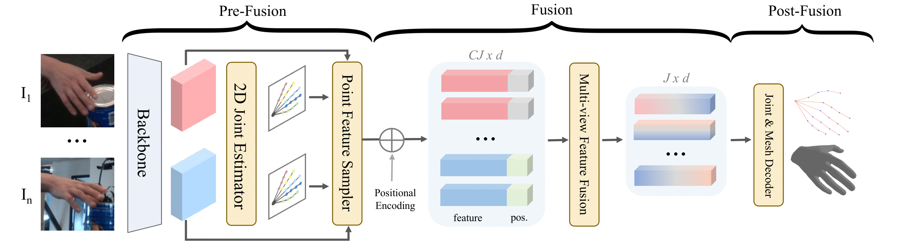

<p align="center">

  <h1 align="center">HandMvNet: Real-Time 3D Hand Pose Estimation using Multi-View Cross-Attention Fusion</h1>
  <p align="center">
    <a><strong>Muhammad Asad Ali</strong></a>
    ·
    <a><strong>Nadia Robertini</strong></a>
    ·
    <a><strong>Didier Stricker</strong></a>
    
  </p>
  <div align="center">
    
  </div>

  <p align="center">
    <br>
    <a href="#">
      
    </a>
  </p>
</p>

In this work, we present HandMvNet, one of the first real-time method designed to estimate 3D hand motion and shape from multi-view camera images. Unlike previous monocular approaches, which suffer from scale-depth ambiguities, our method ensures consistent and accurate absolute hand poses and shapes. This is achieved through a multi-view attention-fusion mechanism that effectively integrates features from multiple viewpoints. In contrast to previous multi-view methods, our approach eliminates the need for camera parameters as input to learn 3D geometry. HandMvNet also achieves a substantial reduction in inference time while delivering competitive results compared to the state-of-the-art methods, making it suitable for real-time applications. Evaluated on publicly available datasets, HandMvNet qualitatively and quantitatively outperforms previous methods under identical settings.
<br/><br/>

# Dependencies
- Cuda 11.7
- Python 3.8
- Pytorch 2.0.1
- Lightning 2.0.6

# Training:
```
python src/train.py --config configs/release/HO3D_HandMvNet.yaml
```
# Evaluation:
#### Test the model
```
python src/eval.py --config configs/release/HO3D_HandMvNet.yaml --checkpoint /path/to/checkpoint.ckpt
```
#### Inference speed
```
python src/eval_fps.py --config configs/release/HO3D_HandMvNet.yaml
```

# To-Dos
- [ ] Add code for DexYCB-MV and MVHand dataset loaders.

# Citation
If you find our work useful in your research, please consider citing:
```

```
# Acknowledgement
The following repositories are used in HandMvNet, either in close to original form or as an inspiration:
- [Hand4Whole_RELEASE](https://github.com/mks0601/Hand4Whole_RELEASE)
- [hamer](https://github.com/geopavlakos/hamer)
- [GraFormer](https://github.com/Graformer/GraFormer)
- [POEM](https://github.com/lixiny/POEM)
- [POEM-v2](https://github.com/JubSteven/POEM-v2)
